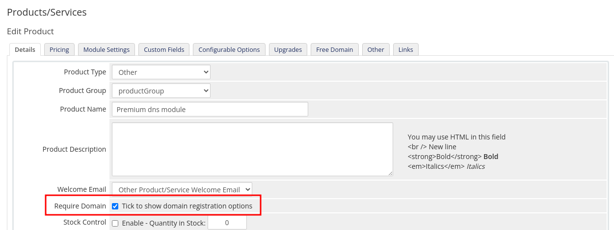
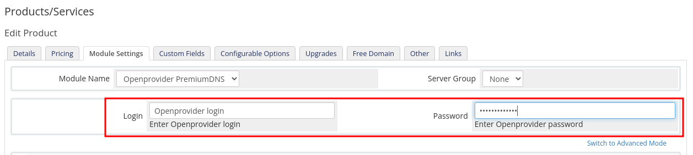
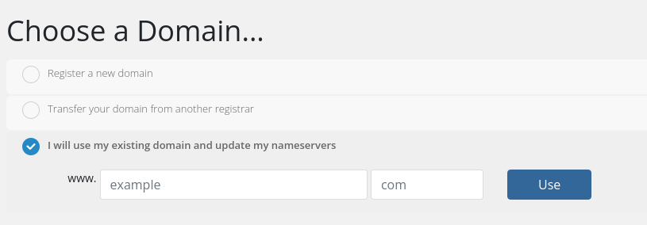
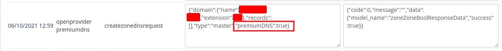

# openprovider-whmcs-premiumDNS

WHMCS Module for providing premium DNS in Openprovider.

## Installation

 1. Copy `./modules/servers/openproviderpremiumdns` into `<WHMCS directory>/modules/servers/openproviderpremiumdns` 

That's all.

## Usage:

### Create _Service_ with this module;

### Turn on a checkbox to confirm usage service with domains;

### Configure Openprovider account data;

### Now you can use this service like common service;

 1. Choose the product;
 2. Select a domain that exists in Openprovider, or register a new one;

 3. Confirm the order.
 4. The Openprovider Api sends request to activate premium dns:

